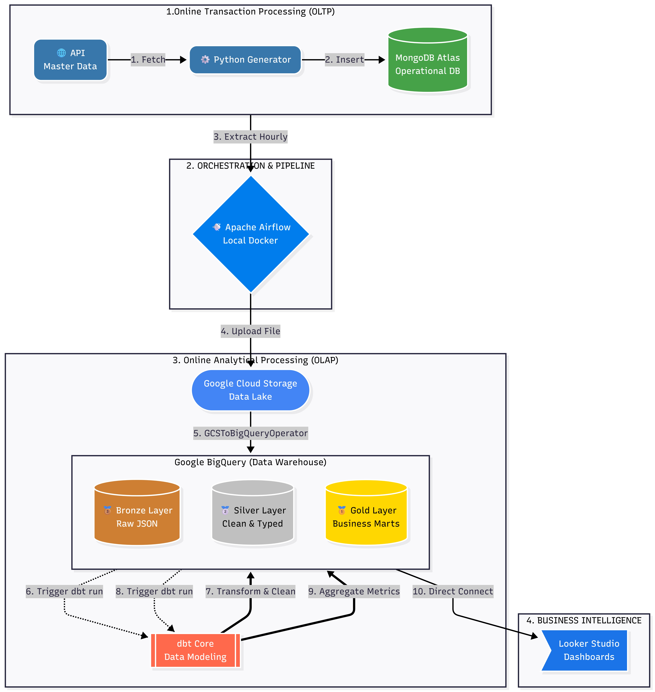

# End-to-End E-Commerce Data Pipeline: From OLTP to Analytics Data Mart

## 1. Project Objective & Business Problem
In the e-commerce ecosystem, real-time transaction data generated by OLTP systems typically has a semi-structured format (nested JSON) and is prone to input anomalies. In its raw operational state, this data is not optimal for direct querying by data analysts, as doing so can degrade the performance of the primary application database and yield inconsistent metrics due to the lack of data cleansing.

This project builds an automated, isolated, and scalable end-to-end data pipeline implementing the **Modern Data Stack (MDS)** principles. The main objectives of this project are:
- To construct an automated data ingestion pipeline from a NoSQL database (MongoDB) to a Cloud Data Warehouse (Google BigQuery).
- To implement a multi-layered data architecture (**Medallion Architecture**) ensuring data quality and cleansing.
- To transform nested transaction data (arrays) into a multidimensional analytical data model (**Star Schema**) to serve Daily Sales Performance reports ready for Business Intelligence (BI) consumption.

---

## 2. System Architecture
This data pipeline is designed with functional isolation at each layer to ensure processing reliability and scalability:



### System Workflow:
1. **Data Generation**: A Python script simulates real-time shopping cart transaction activity from the FakeStore API and stores it transactionally in the operational MongoDB database.
2. **Data Orchestration & Ingestion**: Apache Airflow periodically extracts dimension (master) and fact (transaction) data using `MongoHook`, converts it into Newline-Delimited JSON, and loads it physically into Google BigQuery utilizing the Google Cloud Client Library.
3. **Data Transformation**: dbt Core manages SQL query dependencies to perform data cleansing, normalization, nested array flattening, and final data modeling in parallel.

---

## 3. Tech Stack
- **Core Language**: Python 3.11 (Libraries: `requests`, `pymongo`, `google-cloud-bigquery`)
- **OLTP Storage / Source**: MongoDB
- **Orchestration**: Apache Airflow (Dockerized Environment)
- **Data Warehouse**: Google BigQuery (Region: `us-west1`)
- **Transformation Engine**: dbt Core V1.11 (with `dbt-bigquery` adapter)
- **Data Modeling**: Star Schema & Medallion Architecture (Bronze, Silver, Gold concepts)
- **Target Visualization**: Power BI Desktop / Looker Studio

---

## 4. Data Warehouse Layers (Medallion Architecture)

### A. Bronze Layer (Raw Ingestion)
The initial landing area for raw data ingested by Airflow without schema modification to preserve the original historical data record:
- `raw_carts`: Stores the raw shopping cart transaction payloads in a structured JSON format with nested item arrays.
- `raw_users`: Stores raw customer master profile data directly from the source system.
- `raw_products`: Stores raw product master catalog data.

### B. Silver Layer (Staging, Cleansing & Conformance)
The foundational transformation layer where all models are configured as `Views` in BigQuery for historical storage efficiency:
- `stg_carts`: Utilizes the `UNNEST` function to flatten product array data into individual rows, eliminates negative quantity anomalies, cleans currency character strings, and applies data deduplication techniques using the `ROW_NUMBER()` window function.
- `stg_users`: Concatenates separated name columns and extracts customer city address entities.
- `stg_products`: Standardizes the format of single product prices.

> **Type Safety Enforcement**: All primary identifier columns (`cart_id`, `user_id`, `product_id`) in this phase are forced via explicit casting into `STRING` data types to ensure future compatibility and prevent mathematical failures during `JOIN` operations.

### C. Gold Layer (Analytical Enterprise Marts)
The physical storage layer structured as `Tables`, fully optimized and ready to be consumed by dashboard visualizations:
- `dim_users`: A cleanly denormalized dimension table for customer subject data.
- `dim_products`: A dimension table for the company's product catalog subject area.
- `dm_daily_sales_performance`: A daily aggregated sales fact table that joins the shopping cart transaction data with the product and user master data using `LEFT JOIN` operations.

---

## 5. Data Mart Schema & Analytics Metrics
The final aggregated table, `dm_daily_sales_performance`, exposes the following key business performance metrics:
- **Total Revenue**: The accumulated financial value of sold items, excluding transaction anomalies.
- **Total Orders**: The total volume of unique transactions based on the cart ID.
- **Total Active Buyers**: The number of unique customers who made a transaction on a given day.
- **Average Order Value (AOV)**: The average customer spend per shopping transaction, calculated as the ratio between total revenue and the total volume of unique transactions.

---

## 6. Key Engineering Highlights
- **Advanced JSON Flattening**: Utilized advanced relational SQL compilation techniques (`UNNEST`) within the data warehouse architecture to break down one-to-many relationships in JSON rows without causing compute cost inflation.
- **Idempotent Pipelines**: Airflow ingestion is configured using the `WRITE_TRUNCATE` disposition on master tables to ensure that pipeline reruns (backfilling) do not trigger dimension data duplication.
- **Concurrency & Resource Optimization**: Configured the dbt execution environment to run in parallel utilizing multi-threading (`threads: 4`) to accelerate the compilation process of staging and mart models simultaneously.

---

## 7. Project Deployment & Replication Guide

### Prerequisites
- Docker & Docker Compose installed on the local machine.
- An active Google Cloud Platform (GCP) account with a Service Account Key (`gcp-key.json`) that has `BigQuery Admin` privileges.

### Step 1: Environment Setup
Clone this repository and place your GCP encryption key in the Airflow operational directory:
```bash
git clone [https://github.com/adeikmalm/ecom-pipeline-gcp-project.git](https://github.com/adeikmalm/ecom-pipeline-gcp-project.git)
cd ecom-pipeline-gcp-project
cp /path/to/your/gcp-key.json dags/gcp-key.json
